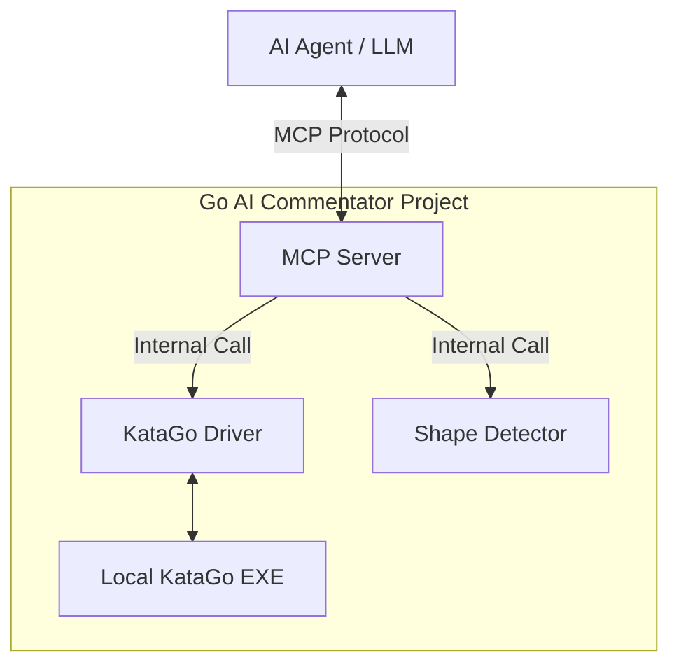

# Design: Go Engine as MCP Tool

This document details the first proposal from `IDEAS.md`: wrapping the existing Go analysis capabilities into an **MCP Server**.

## 1. Overview
The **Model Context Protocol (MCP)** allows AI models to safely interact with local data and tools. By turning this project into an MCP Server, an AI agent (like Claude or Gemini) can "think" with the power of KataGo and the project's shape detecton logic.

## 2. Architecture
The integration adds a new entry point that implementation the MCP specification.

## 3. Potential MCP Tools

### `analyze_position`
- **Arguments**: `history` (List of moves in GTP or SGF format), `board_size`.
- **Action**: Runs KataGo analysis on the given position.
- **Return**: Winrate, score lead, and top 3 candidate moves with their sequences.

### `detect_shapes_at`
- **Arguments**: `history`.
- **Action**: Runs the specialized logic from `ShapeDetector`.
- **Return**: List of identified shapes (e.g., "Aki-sankaku at D4", "Atari at E5").

### `solve_life_and_death` (Future Expansion)
- **Arguments**: `history`, `target_point`.
- **Action**: Uses KataGo to verify if a group is alive or dead.

## 4. Example Use Case
**User**: "このD4周辺の形について、AIはどう見ていますか？"
**AI Agent**: 
1. Calls `analyze_position` tool.
2. Receives output: "Score Lead: -5.0 (B), Recommendation: D3".
3. Calls `detect_shapes_at` tool.
4. Receives output: "Found: Aki-sankaku (Bad Shape)".
5. **Final Response**: "AIの評価では黒が5目ほど不利です。D4付近に『アキ三角』という効率の悪い形ができており、それが評価を下げています。D3と打って形を整えるのが推奨されています。"

## 5. Benefits
- **Autonomy**: The agent can perform "fact-finding" missions without the user having to manually click buttons in the GUI.
- **Deep Insight**: The agent combines KataGo's raw strength with the project's human-readable shape detection.
- **Contextual Awareness**: The agent "sees" the board exactly as the program does.
